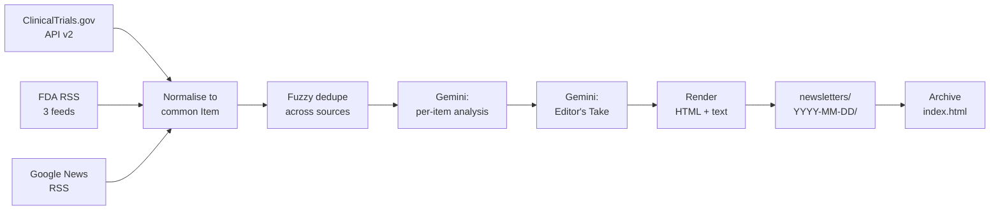

# MS Market Pulse

**An automated competitive-intelligence briefing for the Multiple Sclerosis market.**

Every Monday morning, this system reads the week's regulatory filings, clinical-trial
activity and industry news for Multiple Sclerosis, works out what actually matters,
writes an analyst-grade summary of each development, and publishes a formatted
newsletter — with no human involvement at any step.

It is the kind of recurring desk research an analyst might spend half a day on each
week. Here it runs in about a minute, on a schedule, for a fraction of a cent.

### 📄 **[Read this week's issue →](https://aryamanbagchi.github.io/ms-market-pulse/)**

_Published automatically every Monday. No human touches it._


---

## What problem this solves

Competitive intelligence in a single therapy area is high-value but repetitive. Someone
has to check the same handful of sources every week, decide what is signal and what is
noise, and write it up in a form a brand or pipeline lead will actually read.

The checking and the writing-up are both automatable. The judgement about *what matters*
is the interesting part — and that is where the language model earns its place, scoring
each development for market impact and explaining the competitive implication rather
than just restating the headline.

## What it produces

Each issue contains:

- **An Editor's Take** — a 4–6 sentence executive overview identifying the week's
  through-line, written after every item has been analysed.
- **Developments grouped into Regulatory, Clinical and Commercial/Corporate**, sorted so
  the most consequential item in each section is first.
- **For every item:** a 2–3 sentence analyst summary, a "why it matters" line naming the
  concrete competitive implication, an impact score from 1 to 5, and a link to the
  primary source.

Output is a single self-contained HTML file with no external assets — it renders
identically from disk, from GitHub Pages, or pasted into an email client. A plain-text
version is written alongside it.

## Where the data comes from

| Source | What it provides | Access |
|---|---|---|
| **ClinicalTrials.gov API v2** | MS studies newly posted or status-changed in the last 7 days — sponsor, phase, status, summary | Free, no key |
| **U.S. FDA RSS** — press releases, drugs, MedWatch | Approvals, label changes, safety communications | Free, no key |
| **Google News RSS** | Company, deal, pricing and market coverage | Free, no key |
| **Google Gemini** | Summarisation, categorisation, impact scoring, editorial | API key |

Three FDA feeds are polled rather than one. The agency-wide press-release feed carries
only ~20 items covering everything FDA does, so MS announcements surface in it just a few
times a year; the drugs and MedWatch feeds are where the relevant regulatory activity
actually appears.

## Architecture



```
run.py              Entry point and CLI
config.py           All tunables: sources, keywords, model, thresholds
core/               Item model, fuzzy dedupe, response cache
fetchers/           One module per source, plus shared HTTP and filtering
ai/                 Gemini REST client, per-item analysis, Editor's Take, offline fallback
render/             HTML newsletter, plain text, archive page
data/sample/        Real captured responses, used for offline runs
newsletters/        Published issues + manifest.json
```

## How it runs autonomously

A GitHub Actions workflow (`.github/workflows/newsletter.yml`) runs every Monday at
**08:00 IST**, generates the issue, commits it back to the repository, and GitHub Pages
republishes the site automatically. The Gemini API key lives in a repository secret. No
server, no database, no scheduler to maintain — and the whole thing runs inside GitHub's
free tier.

The design assumption is that **nobody is watching when it runs**, so every failure mode
degrades instead of breaking:

| If this happens | The pipeline does this |
|---|---|
| One source is down | Logs a warning, publishes with the other two |
| A single record is malformed | Skips that record, keeps the rest of the feed |
| A Gemini call fails or returns unusable JSON | Retries once, then falls back to deterministic summarisation for that item |
| No API key is present | Runs end to end with rule-based enrichment and says so in the footer |
| It is a genuinely quiet week | Renders a "quiet week" note explaining that all sources were checked |

The result is that an issue is *always* published, and it never looks broken.

## Running it yourself

Requires Python 3.9 or newer (CI runs 3.11).

```bash
pip install -r requirements.txt
export GEMINI_API_KEY="your-key"     # get one at https://aistudio.google.com/apikey
python run.py
```

Then open `newsletters/<today>/index.html`.

| Command | What it does |
|---|---|
| `python run.py` | Normal run: live sources + Gemini |
| `python run.py --dry-run` | Renders from captured fixtures. **No network, no API calls** |
| `python run.py --no-ai` | Fetches live but skips Gemini |
| `python run.py --no-cache` | Ignores today's cache and refetches |
| `python run.py --date 2026-07-27` | Generates the issue for a specific date |
| `python run.py -v` | Debug logging |

Raw responses are cached per-day under `data/cache/`, so re-running on the same day makes
zero network calls. That makes iterating on the templates or prompts free.

Configuration is via environment variable: `GEMINI_API_KEY` (required for AI output) and
`GEMINI_MODEL` (optional, defaults to `gemini-3.6-flash`).

> **Note on model availability:** the Gemini 2.x models still appear in the API's
> `ListModels` response but return `404 — no longer available to new users` for recently
> issued API keys. Presence in `ListModels` is not proof of access; verify with a real
> `generateContent` call before pinning a model.

## Notable engineering decisions

**Gemini over REST rather than the SDK.** `google-genai` 2.x requires Python ≥3.10, which
would have meant one SDK version locally and a different one in CI. Calling the REST
endpoint keeps a single code path everywhere and holds the dependency list to two
packages.

**Structured output enforced at the API level.** Rather than asking the model for JSON and
hoping, each call sends a `responseSchema` that constrains generation. The parser still
strips code fences and retries once, and falls back to deterministic enrichment after
that — three layers, because a model returning almost-JSON is the normal failure mode.

**Deduplication without a dependency.** The same story often appears in several sources.
Titles are normalised (case-folded, punctuation and stopwords stripped, tokens sorted)
and compared with stdlib `difflib`. At tens of items per run this is more than accurate
enough, and it keeps the dependency list at two.

**Email-safe HTML.** Table-based layout with styles inlined on each element, because Gmail
and Outlook discard `<style>` blocks. The `<style>` block carries only progressive
enhancements — responsive breakpoints and dark mode — that browsers honour and email
clients ignore.

**A deterministic path that is always available.** The rule-based enrichment in
`ai/fallback.py` is not just error handling; it is what makes the project testable
offline, demonstrable without an API key, and cheap to iterate on.

## What I would build next

- **More therapy areas.** The source and keyword configuration is already isolated in
  `config.py`; adding oncology or immunology is a config change plus a keyword set, not a
  rewrite.
- **Email delivery.** The HTML is already email-safe. Adding Resend or SES would make this
  a genuine subscriber newsletter rather than a published page.
- **Week-over-week trend tracking.** The manifest already records per-category counts.
  Storing enriched items would enable "third BTK inhibitor readout this quarter" style
  observations — the analysis that a human analyst does across issues.
- **Entity resolution** on sponsors and assets, so Roche and Genentech resolve to one
  organisation and every ocrelizumab study links to a single asset timeline.
- **Evaluation harness** for the AI layer — a labelled set of past items to measure
  whether scoring and categorisation stay stable when the prompt or model changes.

---

*Generated content summarises public information for competitive-intelligence purposes.
It is not medical, investment or regulatory advice.*
